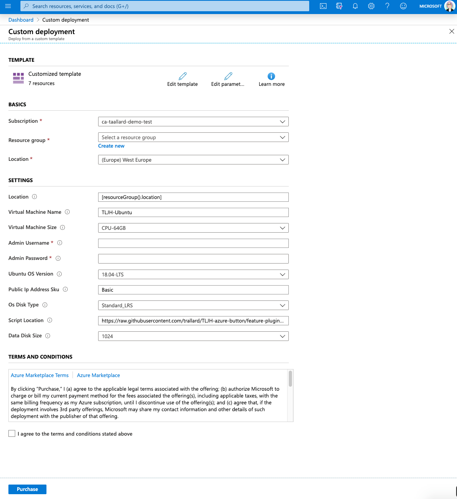

# The Littlest JupyterHub deploy to Azure button

- [The Littlest JupyterHub deploy to Azure button](#the-littlest-jupyterhub-deploy-to-azure-button)
  - [Pre requisites](#pre-requisites)
  - [:thinking: What is the Littlest JupyterHub?](#thinking-what-is-the-littlest-jupyterhub)
  - [What is in this repo?](#what-is-in-this-repo)
  - [💻 How does the Deploy on Azure button work?](#%f0%9f%92%bb-how-does-the-deploy-on-azure-button-work)
  - [🚧 Architecture](#%f0%9f%9a%a7-architecture)
  - [:book: Additional resources](#book-additional-resources)
  - [Issues and contributing](#issues-and-contributing)

## Pre requisites
You will need an Azure account to be able to spin your JupyterHub. 

:star: You can get a free acount with 150 USD worth of credit following 👉🏼 [this link](https://azure.microsoft.com/free/?WT.mc_id=TLJHbutton-github-taallard) 👈🏼

## :thinking: What is the Littlest JupyterHub?
A simple JupyterHub distribution for a small (1-100) number of users on a single server. You can find more info about it in the official docs 👉🏼
[https://the-littlest-jupyterhub.readthedocs.io/en/latest/index.html](https://the-littlest-jupyterhub.readthedocs.io/en/latest/index.html)

## What is in this repo?

This repository contains the ARM (Azure Resource Manager) template for the Littlest JupyterHub deployment. Allowing you to deploy a vanilla Littlest JupyterHub by clicking on the deploy to Azure blue button at the top of this document.

## 💻 How does the Deploy on Azure button work?
The ARM template contains all the basic configuration needed to deploy a your own  Littlest JupyterHub on Azure. 

This template follows the configuration detailed in [https://the-littlest-jupyterhub.readthedocs.io/en/latest/install/azure.html](https://the-littlest-jupyterhub.readthedocs.io/en/latest/install/azure.html). But it reduces some of the friction by eliminating the need to create resources manually using the Azure portal.

🚨 Note that you still need to manually remove your resources when you are done using them.

🚧 To deploy your TLJH follow these steps:

1. Create an Azure account (if you need a free one go to 👉🏼 [this link](https://azure.microsoft.com/free/?WT.mc_id=TLJHbutton-github-taallard) 👈🏼)
2. Click on the `Deploy to Azure` button at the top of the Readme. This will redirect you to the Azure portal login page.
3. Login to your account.
4. Fill in the details in the next screen:

- **Subscription**: choose the subscription you want to use (e.g. Free Trial)
- **Resource group**: this will keep all of our resources together. If you have never created a resource group click on `Create new` and give it a meaningful name (e.g. jupyter-resources)
- **Location**: this is the Azure region where all your resources will be located (e.g. WestEurope, you can check all the available regions [here](https://azure.microsoft.com/global-infrastructure/services/?products=virtual-machines&WT.mc_id=TLJHbutton-github-taallard))
- **Virtual Machine Name**: the name for your virtual machine
- **Virtual Machine Size**: this will be determined by the workload. You can check the list of available VM sizes [here](https://docs.microsoft.com/azure/virtual-machines/linux/sizes-general?WT.mc_id=TLJHbutton-github-taallard)
- **Admin UserName**: this will be the root user and is needed for the management of your TLJH
- **Admin password**: choose a secure password for your root user
- **OS Disk Type**: you have the options Standard HDD (LRS), Standard SSD and Premium SSD (for more details see [the docs](https://docs.microsoft.com/azure/virtual-machines/windows/disks-types?WT.mc_id=TLJHbutton-github-taallard))
- **Data Disk Size**: the size of your Data disk size (for more details [visit the docs](https://docs.microsoft.com/azure/virtual-machines/windows/disks-types?WT.mc_id=TLJHbutton-github-taallard))

By default the template allows network traffic through `http` and `https`, do not modify the `network and security group rules`.

5. Once completed read the terms and conditions and if you are happy with them tick the `I agree to the terms and conditions stated above` box and click on the **Purchase button**.

The deployment will take around 10 minutes - first all your resources will be deployed and then THLJ will be installed on your VM.

6. To check your new Virtual Machine Expand the left-hand panel by clicking on the “>>” button on the top left corner of your dashboard. Find the Virtual Machines tab and click on it.

7. Click on your Virtual Machine, copy the **Public IP address** and access it on the web browser.

🚨 Note this page will be unavailable during installation. If this happens give it a bit longer and refresh the page.

Once the installation is complete you will get a login page 

8. Login using the **admin username and password** you created before
9. Congratulations you have a running working JupyterHub 🎉

👩🏿‍💻✨ You are now ready to add users, install packages and star using your JupyterHub. For instructions on how to do this visit 👉🏼 [the official documentation](https://the-littlest-jupyterhub.readthedocs.io/en/latest/install/azure.html#step-2-adding-more-users)

## 🚧 Architecture
When you deploy a JupyterHub on Azure (either using the Deploy to Azure button or follow the steps from the docs) the following resources are created:

They are all grouped together in the same region defined for your Resource group.

Details on how to delete and stop your virtual machine can be found at [https://the-littlest-jupyterhub.readthedocs.io/en/latest/howto/providers/azure.html](https://the-littlest-jupyterhub.readthedocs.io/en/latest/howto/providers/azure.html).

If you want to get rid of all the associated resources after you are done with your JupyterHub the easiest way to do it is deleting the resource group altoghether (providing you do not have other resources in this group that you might need later).

To delete a resource group:

1. Go to "Resource groups” on the left hand panel of your Azure Portal.
2. Click on the resource group that contains your JupyterHub resources.
3. Click on “Delete resource group” you will then be asked to confirm the operation. This operation will take between 5 and 10 minutes.

## :book:  Additional resources
Here are some links that you might find useful when using the contents in this repo.

- [Azure Resource Manger templates docs](https://docs.microsoft.com/azure/azure-resource-manager/template-deployment-overview?WT.mc_id=TLJHbutton-github-taallard)
- [The Littlest JupyterHub docs](https://the-littlest-jupyterhub.readthedocs.io/en/latest/index.html) 
- [VM available regions](https://azure.microsoft.com/global-infrastructure/services/?products=virtual-machines&WT.mc_id=TLJHbutton-github-taallard)
- [Azure VM sizes](https://docs.microsoft.com/azure/virtual-machines/linux/sizes-general?WT.mc_id=TLJHbutton-github-taallard)
- [Azure VMs disks](https://docs.microsoft.com/azure/virtual-machines/windows/disks-types?WT.mc_id=TLJHbutton-github-taallard)

## Issues and contributing

Contributions are welcome. Also if you encounter any issues please go ahead and create an issue in this repo.

The detailed contribution guidelines can be found 👉🏼 [here](./CONTRIBUTING.md)