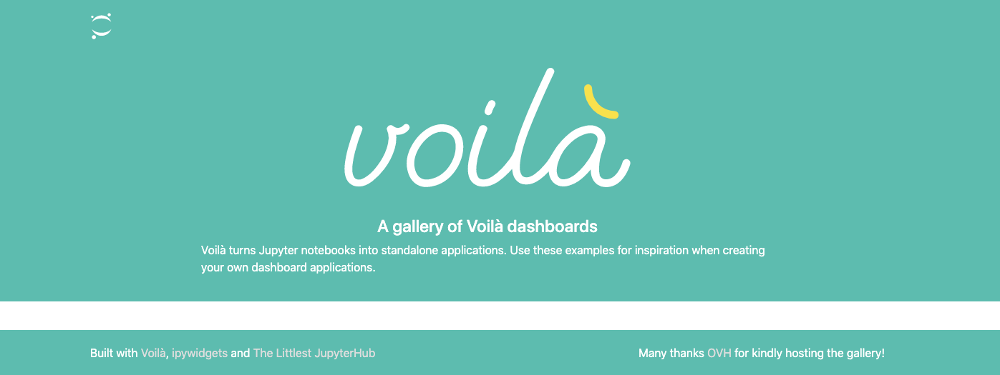
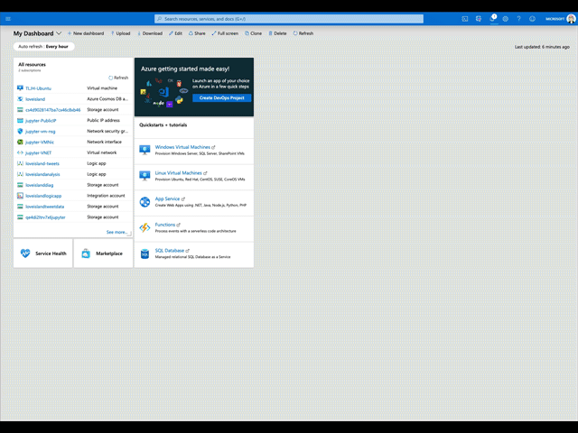

<div align="center">
<h1> The Littlest JupyterHub deploy to Azure button </h1>
</div>

[](https://GitHub.com/trallard/TLJH-azure-button/releases/)

 :sparkles::sparkles: Now you can install plugins and customise your JupyterHub deployment as per the [instructions in the main TLJH documentation](http://tljh.jupyter.org/en/latest/topic/customizing-installer.html) :sparkles::sparkles:

 Now the VM size selector is a dropdown based on the VM Memory Size

<table style="width:auto; margin-left:auto; margin-right:auto;">
 <tr>
 <td align='center' width='100%'>
 <a href="https://portal.azure.com/#create/Microsoft.Template/uri/https%3A%2F%2Fraw.githubusercontent.com%2Ftrallard%2FTLJH-azure-button%2Fmaster%2Fazuredeploy.json" target="_blank">
 

 </a>
 </br>
 </br>
 Deploy your own Littlest JupyterHub using the blue button above 👆🏼
 </td>
 </tr>
 <tr>
 <td align='center' width='100%'>
 This project is licensed under the <a href="https://opensource.org/licenses/MIT" target="_blank"> MIT OSI license. </a>
 <br>
 <a target="_blank" href='https://opensource.org/licenses/MIT'>
 
 </a>
 </td>
 </tr>
</table>

- [📝 Prerequisites](#-prerequisites)
- [:thinking: What is the Littlest JupyterHub?](#-what-is-the-littlest-jupyterhub)
- [🔍 What is in this repo?](#-what-is-in-this-repo)
- [💻 How does the Deploy on Azure button work?](#%-how-does-the-deploy-on-azure-button-work)
- [✨ Customising the installer](#-customising-the-installer)
- [🚧 Architecture](#-architecture)
- [:book: Additional resources](#book-additional-resources)
- [:clap: Useful tips and commands](#clap-useful-tips-and-commands)
- [🖖🏼 Issues and contributing](#-issues-and-contributing)

## 📝 Prerequisites

You need an Azure account to be able to spin your JupyterHub.

:star: If you do not have an Azure subscription you can get started with a [free Azure subscription with 200 USD](https://azure.microsoft.com/free/?WT.mc_id=TLJHbutton-github-taallard)

## :thinking: What is the Littlest JupyterHub?

A simple JupyterHub distribution for a small (1-100) number of users on a single server. You can find more info about it in the [official docs][TLJH-docs].

## 🔍 What is in this repo?

This repository contains the ARM (Azure Resource Manager) template for the Littlest JupyterHub deployment. This template was created to help you deploy a vanilla Littlest JupyterHub by clicking on the deploy to Azure blue button at the top of this document.

It follows the recommended configuration in the official [The Littlest JupyterHub docs][TLJH-docs] but eliminates the deployment friction by predefining some standard settings.

## 💻 How does the Deploy on Azure button work?

The ARM template contains all the necessary configuration needed to deploy your own Littlest JupyterHub on Azure.

This template follows the configuration detailed in [https://the-littlest-jupyterhub.readthedocs.io/en/latest/install/azure.html](https://the-littlest-jupyterhub.readthedocs.io/en/latest/install/azure.html). But it reduces some of the friction by eliminating the need to create resources manually using the Azure portal.

🚨 Note that you still need to remove your resources manually when you are done using them. Otherwise you will be charged for their use.

🚧 To deploy your TLJH follow these steps:

1. Create an Azure account (if you need a free one go to 👉🏼 [this link](https://azure.microsoft.com/free/?WT.mc_id=TLJHbutton-github-taallard) 👈🏼)
2. Click on the `Deploy to Azure` button at the top of the this Readme. This will redirect you to the Azure portal login page.
3. Login to your account.
4. Fill in the details in the next screen: (see details below)


- **Subscription**: choose the subscription you want to use (e.g. Free Trial)
- **Resource group**: this will keep all of our resources together. If you have never created a resource group click on `Create new` and give it a meaningful name (e.g. jupyter-resources)
- **Location**: this is the Azure region where you want all your resources to be (e.g. WestEurope, you can check all the available regions [here](https://azure.microsoft.com/global-infrastructure/services/?products=virtual-machines&WT.mc_id=TLJHbutton-github-taallard))
- **Virtual Machine Name**: the name for your virtual machine. The deault is TLHJ-Ubuntu but you can choose any name you prefer.
- **Virtual Machine Size**: the workload will determine this. You can check the list of available VM sizes [here](https://docs.microsoft.com/azure/virtual-machines/linux/sizes-general?WT.mc_id=TLJHbutton-github-taallard). This is a dropdown from version 1.1.0 onwards
- **Admin UserName**: this will be the root user and is needed for the management of your TLJH
- **Admin password**: choose a secure password for your root user. Note that this is not displayed later on in the outputs for security reasons so make sure to make note of it.
- **OS Disk Type**: you have the options Standard HDD (LRS), Standard SSD and Premium SSD (for more details see [the docs](https://docs.microsoft.com/azure/virtual-machines/windows/disks-types?WT.mc_id=TLJHbutton-github-taallard)). The default value is `Standard_LRS`.
- **Data Disk Size**: the size of your Data disk size (for more information [visit the docs](https://docs.microsoft.com/azure/virtual-machines/windows/disks-types?WT.mc_id=TLJHbutton-github-taallard))
- **Script Location**: This is the script that installs the Jupyter server in your VM. By default it points to the script in this repository corresponding to the vanilla install of TLJH ([scripts/install.sh](scripts/install.sh)). Read more in the [customising the installer section](#-customising-the-installer) of this Readme.

By default, the template allows network traffic through `HTTP` and `https`.

5. Once completed, read the terms and conditions and if you are happy with them, go ahead and tick the `I agree to the terms and conditions stated above` box and click on the **Purchase button**.

   The deployment will take around 10 minutes - first, all your resources will be deployed, and then THLJ will be installed on your VM.

6. To check your new Virtual Machine Expand the left-hand panel by clicking on the ">>" button on the top left corner of your dashboard. Find the Virtual Machines tab and click on it.


7. Click on your Virtual Machine, copy the **Public IP address**  and access it through your web browser.


🚨 Note this page will be unavailable during installation of the server. If this happens, be patient, give it a bit longer and refresh the page.

Once the installation is complete, you will get a login page like the one below:

<div align="center">

</div>

8. Login using the **admin username and password** you created before
9. Congratulations you have a running working JupyterHub 🎉

👩🏿‍💻✨ You are now ready to add users, install packages and start using your JupyterHub. For instructions on how to do this visit 👉🏼 [the official documentation](https://the-littlest-jupyterhub.readthedocs.io/en/latest/install/azure.html#step-2-adding-more-users).

## ✨ Customising the installer

You can customise the installer by adding command line parameters. From v1.1.0 you can now specify a TLJH install script to customise the install.

For example, if you want to install Python packages in the user environment from a `requirements.txt` file you can pass the parameter `--user-requirements-txt-URL <url-to-requirements.txt>` where `URL-to-requirements.txt` must be a valid URL:

```sh
--user-requirements-txt-URL https://raw.githubusercontent.com/data-8/materials-sp18/master/requirements.txt
```

⚠️ **Note**

When pointing to a file on GitHub, make sure to use the 'Raw' version. It should point to `raw.githubusercontent.com`, not `github.com`.

Let's use as example the `voilà-gallery plugin`. First you will have to create a bash script with the customised Jupyterhub installer:

```sh
# !/bin/bash

curl https://raw.githubusercontent.com/jupyterhub/the-littlest-jupyterhub/master/bootstrap/bootstrap.py \
 | sudo python3 - \
   --plugin git+https://github.com/voila-dashboards/tljh-voila-gallery@master#"egg=tljh-voila-gallery&subdirectory=tljh-voila-gallery"
```

and update the `scriptLocation` parameter accordingly when deploying your littlest JupyterHub (in the details form asfter you log into your Azure account). For the above example:

```sh
https://raw.githubusercontent.com/trallard/TLJH-azure-button/feature-plugins/scripts/install_voila.sh
```

So once the VM is created and the plugins installed you can go to the public IP of your VM. In the case of the Voilà plugin you will be greeted with this screen instead of the usual TLHJ one:



Always make sure that the script is publicly available (e.g. public repo, public gist) and that you are pointing to the `raw` content.

For more details on customising your installation visit [the main TLJH documentation](http://tljh.jupyter.org/en/latest/topic/customizing-installer.html).

In this repo you will find the following install scripts:

- Vanilla TLHJ install script: [./scripts/install.sh](./scripts/install.sh)
  
- TLJH + Pangeo plugin script: [./scripts/install_pangeo.sh](./scripts/install_pangeo.sh)

- TLJH + Voila dashboard plugin script: [./scripts/install_voila.sh](./scripts/install_voila.sh)
  

## 🚧 Architecture
When you deploy a JupyterHub on Azure (either using the Deploy to Azure button or follow the steps from the docs) the following resources are created:


They are all grouped in the same region defined for your Resource group.
Also, note that the storage disk created with this template will be of the same type of the `OS disk type` you provide on the template.

If you want to learn more about VM types and sizes, including compatibility between the VMS and storage (standard or premium) you can visit the [official Azure Linux VM documentation](https://docs.microsoft.com/azure/virtual-machines/linux/sizes?WT.mc_id=TLJHbutton-github-taallard).

Details on how to delete and stop your virtual machine can be found at [https://the-littlest-jupyterhub.readthedocs.io/en/latest/howto/providers/azure.html](https://the-littlest-jupyterhub.readthedocs.io/en/latest/howto/providers/azure.html).

If you want to get rid of all the associated resources after you are done with your JupyterHub the easiest way to do it is deleting the resource group altogether (providing you do not have other resources in this group that you might need later).

⚡️ To delete a resource group from the Azure portal:

1. Go to **Resource groups** on the left-hand panel of your Azure Portal.
2. Click on the resource group that contains your JupyterHub resources.
3. Click on **Delete resource group** you will then be asked to confirm the operation. This operation will take between 5 and 10 minutes.



See the [useful tips and commands](#clap-useful-tips-and-commands) section for the command to delete using the command line and the azure cli.

## :book: Additional resources

Here are some links that you might find useful when using the contents in this repo.

:book: [Azure Resource Manger templates docs](https://docs.microsoft.com/azure/azure-resource-manager/template-deployment-overview?WT.mc_id=TLJHbutton-github-taallard)

:book: [The Littlest JupyterHub docs](https://the-littlest-jupyterhub.readthedocs.io/en/latest/index.html)

:book: [VM available regions - Azure docs](https://azure.microsoft.com/global-infrastructure/services/?products=virtual-machines&WT.mc_id=TLJHbutton-github-taallard)

:book: [Azure VM sizes documentation](https://docs.microsoft.com/azure/virtual-machines/linux/sizes-general?WT.mc_id=TLJHbutton-github-taallard)

:book: [Azure VMs disks documentation](https://docs.microsoft.com/azure/virtual-machines/windows/disks-types?WT.mc_id=TLJHbutton-github-taallard)

:book: [Install the Azure CLI](https://docs.microsoft.com/en-us/cli/azure/install-azure-cli?view=azure-cli-latest?WT.mc_id=TLJHbutton-github-taallard)

## :clap: Useful tips and commands

If you are familiar with the command line you and have the `az cli` installed ther following commands might come handy:

- Finding available VM sizes in a specific location

```sh
az vm list-sizes --location <location> --output table
```

- View the current size of a VM with:

```sh
az vm show --resource-group <resource-group> --name <VirtualMachineName> --query hardwareProfile.vmSize
```

- You can resize your VM after it has been deployed if needed

```sh
# First check if the desired size is available
az vm list-vm-resize-options --resource-group <resource-group> --name  <VirtualMachineName> --query [].name

# resize the VM
az vm resize --resource-group <resource-group> --name  <VirtualMachineName> --size <desired-size>
```

- Stop virtual machine

```sh
az vm stop --resource-group <resource-group> --name  <VirtualMachineName>
```

- Delete resource group

```sh
az group delete --name <resource-group> --no-wait --yes
```

## 🖖🏼 Issues and contributing

Contributions are welcome. Also, if you encounter any issues, please go ahead and create an issue in this repo.

The detailed contribution guidelines can be found at [CONTRIBUTING](./CONTRIBUTING.md), make sure to have a look first :eyes:

<!-- Links -->

[TLJH-docs]: https://the-littlest-jupyterhub.readthedocs.io/en/latest/index.html
